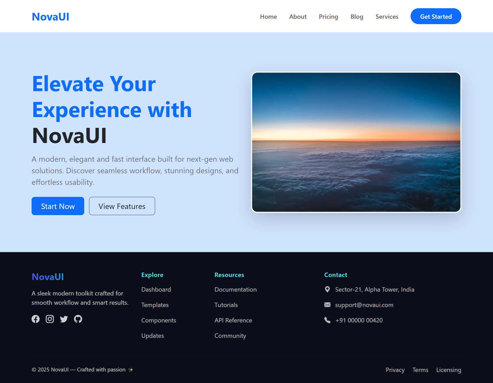
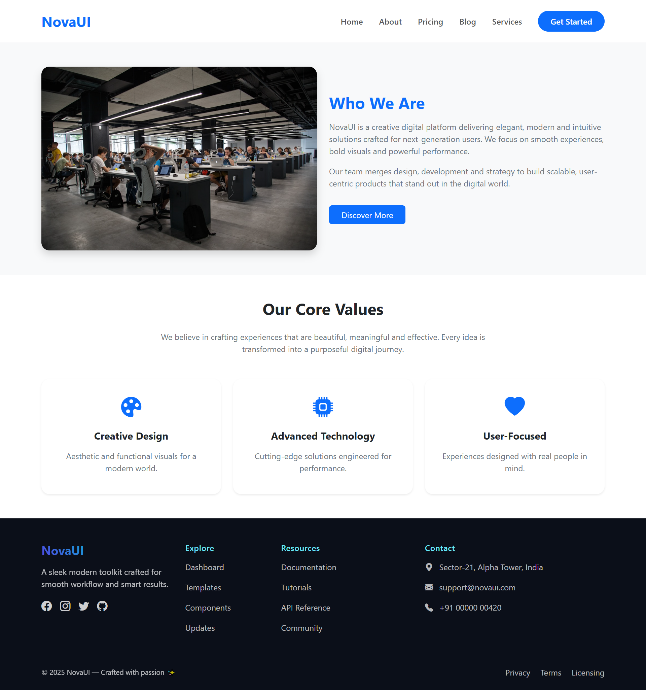
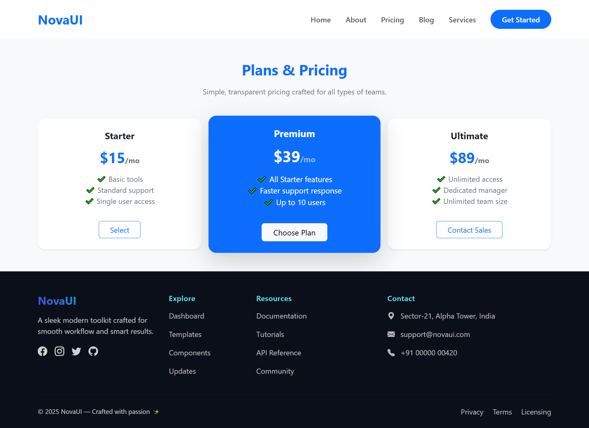
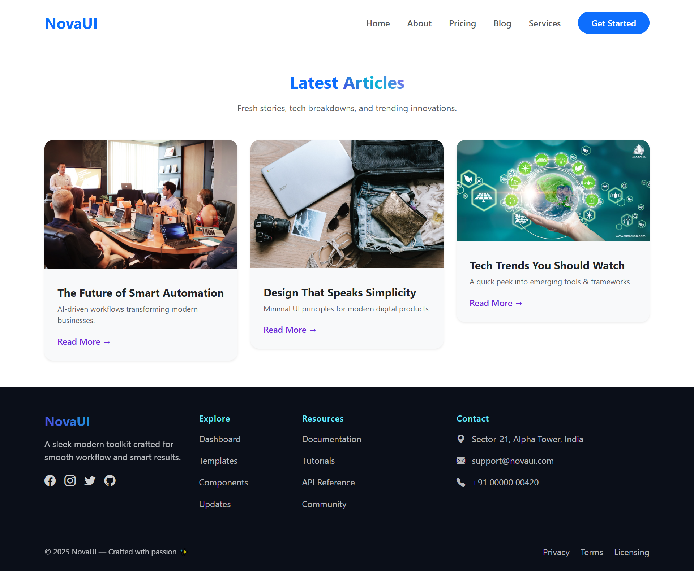
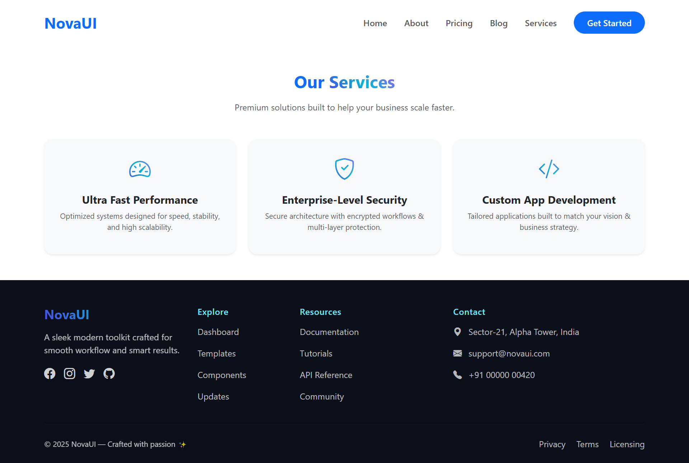

# 🚀 NovaUI Multi-Page Website  

This project is a **multi-page dynamic website** built using **Node.js**, **Express**, **EJS**, and **Bootstrap**.  
It demonstrates **modern UI design**, responsive layouts, and structured page routing with **server-side rendering**.  
The website includes pages such as **Home**, **About**, **Pricing**, **Blog**, and **Services**, each styled with a **NovaUI-inspired theme**.

---

## 📄 Features  

* 🏠 **Multi-Page Layout** — Home, About, Pricing, Blog, Services  
* 🎨 **NovaUI Modern Theme** — Clean, gradient colors with hover animations  
* 🔧 **Responsive Design** — Fully compatible with desktop, tablet, and mobile  
* 🖼️ **Dynamic Images & Cards** — All sections use professional stock images and interactive cards  
* ⚡ **EJS Templating** — Header and footer included dynamically on each page  
* 🚀 **Hover & Animation Effects** — Smooth card hover, button, and image animations  
* 💾 **Static & Dynamic Sections** — Uses Express routes to serve dynamic content  

---

## 🛠️ Tech Stack  

    
  <b>Node.js</b> — Server-side JavaScript runtime  
    

    
  <b>Express.js</b> — Web framework for routing and handling HTTP requests  
    

    
  <b>EJS</b> — Template engine for dynamic HTML rendering  
    

    
  <b>Bootstrap 5</b> — UI framework for responsive design and components  
    

    
  <b>HTML5 & CSS3</b> — Structure and styling of the website  

---

## 📸 Project Preview  

### 🏠 Home Page  

### ℹ️ About Page  

### 💰 Pricing Page  

### 📝 Blog Page  

### 🛠 Services Page  

---

## ⚙️ How It Works  

1. The **Node.js server** runs and serves EJS templates for each route.  
2. The **header and footer** are dynamically included on all pages via EJS partials.  
3. Each page has **interactive components** such as cards, buttons, and hover animations.  
4. **Bootstrap grid system** ensures responsive design for all devices.  
5. **NovaUI theme** applied: gradient headers, hover animations, and vibrant accents.  

---

